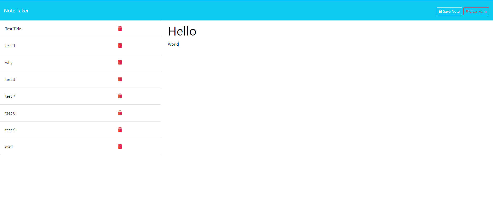

# Note Taker App

## Purpose

I built this website so that users can easily track notes and daily tasks

## Description and Usage

The user is presented with a page with a button to add a new note. Upon clicking, they can enter a note title and a description. When done, they can either clear the contents of the note that they created and start fresh, or they can save the note. The saved note is then displayed on a side bar for the user to track and access later. After saving, the user is then free to create more new notes.

## Links

https://github.com/brettfritz/note-taker

(render link)

## Credits

N/A

## License
MIT License
